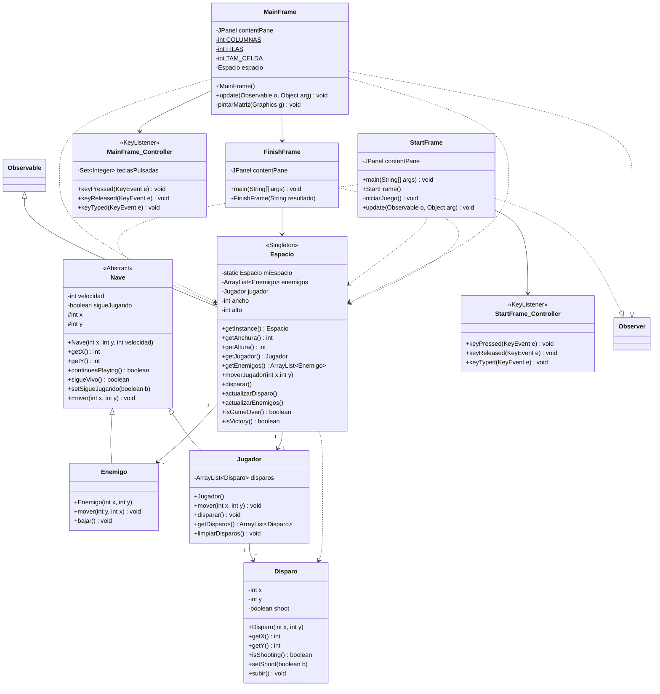

```mermaid
classDiagram

%% =====================
%% MODELO
%% =====================

class Disparo {
  -int x
  -int y
  -boolean shoot
  +Disparo(int x, int y)
  +getX() int
  +getY() int
  +isShooting() boolean
  +setShoot(boolean b)
  +subir() void
}

class Enemigo {
  +Enemigo(int x, int y) 
  +mover(int y, int x) void 
  +bajar() void
}

class Espacio {
  <<Singleton>>
  -static Espacio miEspacio 
  -ArrayList~Enemigo~ enemigos 
  -Jugador jugador 
  -int ancho 
  -int alto 
  +getInstance() Espacio 
  +getAnchura() int 
  +getAltura() int 
  +getJugador() Jugador 
  +getEnemigos() ArrayList~Enemigo~ 
  +moverJugador(int x,int y) 
  +disparar() 
  +actualizarDisparo() 
  +actualizarEnemigos() 
  +isGameOver() boolean 
  +isVictory() boolean
}

class Jugador {
  -ArrayList~Disparo~ disparos 
  +Jugador() 
  +mover(int x, int y) void 
  +disparar() void 
  +getDisparos() ArrayList~Disparo~ 
  +limpiarDisparos() void
}

class Nave {
  <<Abstract>> 
  -int velocidad 
  -boolean sigueJugando 
  #int x 
  #int y 
  +Nave(int x, int y, int velocidad) 
  +getX() int 
  +getY() int 
  +continuesPlaying() boolean 
  +sigueVivo() boolean 
  +setSigueJugando(boolean b) 
  +mover(int x, int y) void
}
%% ===================== 
%% HERENCIA 
%% ===================== 

Nave <|-- Jugador 
Nave <|-- Enemigo 
Observable <|-- Espacio

%% =====================
%% VISTAS
%% =====================

class StartFrame {
 -JPanel contentPane
  +main(String[] args) void
  +StartFrame()
  -iniciarJuego() void
  +update(Observable o, Object arg) void
}

class StartFrame_Controller {
  <<KeyListener>>
  +keyPressed(KeyEvent e) void
  +keyReleased(KeyEvent e) void
  +keyTyped(KeyEvent e) void
}

class MainFrame {
  -JPanel contentPane
  -int COLUMNAS$
  -int FILAS$
  -int TAM_CELDA$
  -Espacio espacio
  +MainFrame()
  +update(Observable o, Object arg) void
  -pintarMatriz(Graphics g) void
}
class MainFrame_Controller {
  <<KeyListener>>
  -Set~Integer~ teclasPulsadas
  +keyPressed(KeyEvent e) void
  +keyReleased(KeyEvent e) void
  +keyTyped(KeyEvent e) void
}
class FinishFrame {
  -JPanel contentPane
  +main(String[] args) void
  +FinishFrame(String resultado)
}

%% =====================
%% RELACIONES DEL MODELO
%% =====================

Jugador "1" --> "*" Disparo 
Espacio "1" --> "1" Jugador 
Espacio "1" --> "*" Enemigo 
Espacio ..> Disparo
StartFrame ..|> Observer
StartFrame ..> Espacio
StartFrame --> StartFrame_Controller
MainFrame ..|> Observer
MainFrame ..> Espacio
MainFrame ..> FinishFrame
MainFrame --> MainFrame_Controller
FinishFrame ..> Espacio
%% =====================
%% RELACIONES MVC
%% =====================

StartFrame ..> Espacio 
MainFrame ..> Espacio 
FinishFrame ..> Espacio

```
